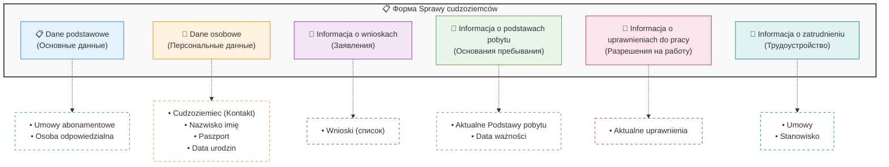
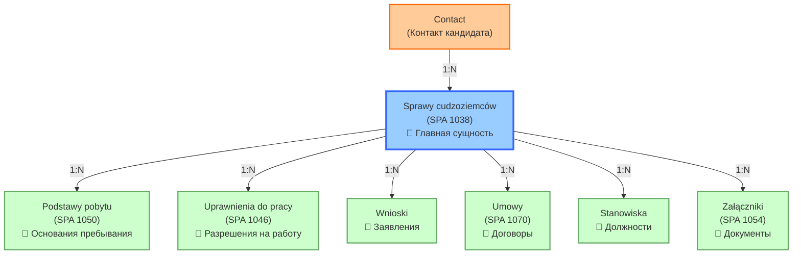
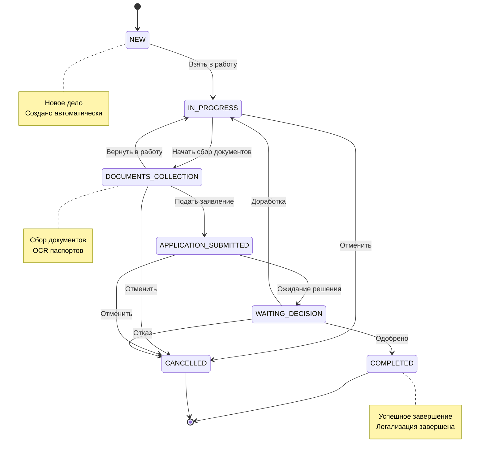
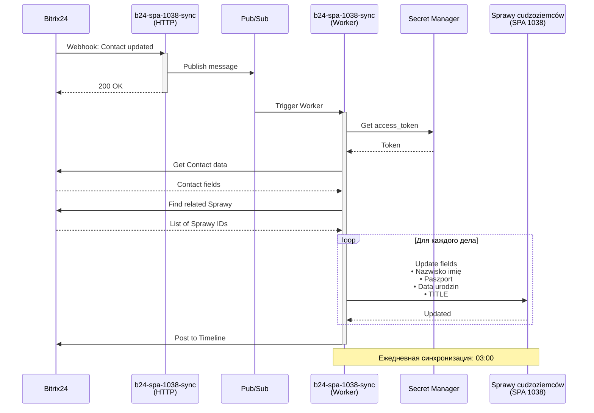
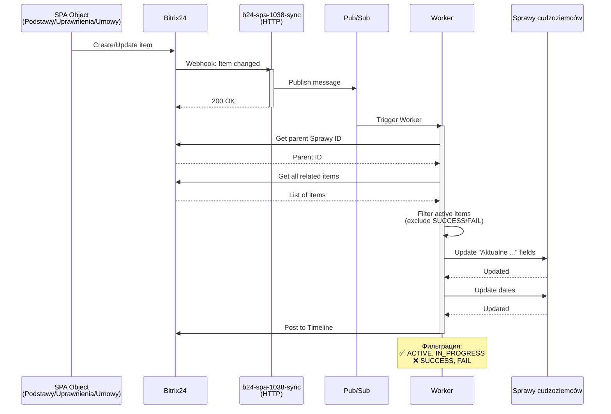
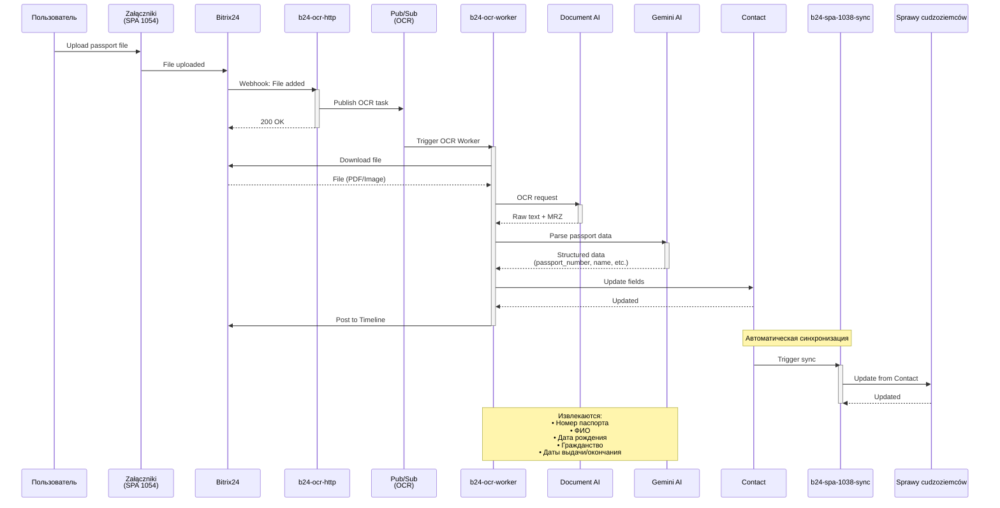
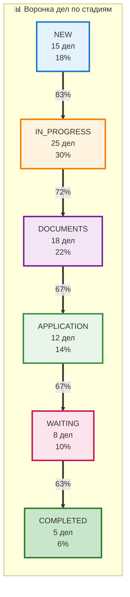

# Sprawy cudzoziemców (SPA 1038)

> **Объект: Дела иностранцев**
>
> Версия: 1.0 | Последнее обновление: 2026-01-04

---

## 🎯 Назначение объекта

**Sprawy cudzoziemców** - главная сущность модуля Legalizacja, которая консолидирует всю информацию по иностранцу и его делу легализации.

**Основные функции:**
- Центральная точка хранения данных о кандидате
- Агрегация связей со всеми связанными объектами
- Отслеживание статуса дела
- Управление процессом легализации

---

## 📊 Структура данных

### Основные поля

| Поле | Тип | Обязательное | Описание |
|------|-----|--------------|----------|
| `ID` | Integer | Да | Уникальный идентификатор дела |
| `TITLE` | String | Да | Название дела (автогенерация) |
| `STAGE_ID` | String | Да | Стадия дела |
| `CREATED_TIME` | DateTime | Да | Дата создания |
| `UPDATED_TIME` | DateTime | Да | Дата последнего обновления |

### Пользовательские поля (UF_CRM_*)

#### Секция: Dane podstawowe (Основные данные)

| Поле | Код поля | Тип | Описание |
|------|----------|-----|----------|
| Umowy abonamentowe | `ufCrm_...` | Связь | Связь с абонементными договорами |
| Osoba odpowiedzialna | `ASSIGNED_BY_ID` | User | Ответственное лицо |

#### Секция: Dane osobowe (Персональные данные)

| Поле | Код поля | Тип | Описание |
|------|----------|-----|----------|
| Cudzoziemiec (Kontakt) | `CONTACT_ID` | Contact | Связь с контактом кандидата |
| Nazwisko imię kandydata | `ufCrm_...` | String | Фамилия и имя (синхронизируется с Contact) |
| Paszport | `ufCrm_...` | String | Номер паспорта (синхронизируется с Contact) |
| Data urodzin | `ufCrm_...` | Date | Дата рождения (синхронизируется с Contact) |

#### Секция: Informacja o wnioskach (Информация о заявлениях)

| Поле | Код поля | Тип | Описание |
|------|----------|-----|----------|
| Wnioski | `ufCrm_...` | CRM (Wnioski) | Связь с заявлениями |

#### Секция: Informacja o podstawach pobytu (Информация об основаниях пребывания)

| Поле | Код поля | Тип | Описание |
|------|----------|-----|----------|
| Aktualne Podstawy pobytu | `ufCrm_...` | CRM (SPA 1050) | Активные основания пребывания |
| Data ważności podstawy pobytu | `ufCrm_...` | Date | Дата действия основания |

#### Секция: Informacja o uprawnieniach do pracy (Информация о разрешениях на работу)

| Поле | Код поля | Тип | Описание |
|------|----------|-----|----------|
| Aktualne uprawnienia do pracy | `ufCrm_...` | CRM (SPA 1046) | Активные разрешения на работу |

#### Секция: Informacja o zatrudnieniu (Информация о трудоустройстве)

| Поле | Код поля | Тип | Описание |
|------|----------|-----|----------|
| Umowy | `ufCrm_...` | CRM (SPA 1070) | Договоры с кандидатом |
| Stanowisko | `ufCrm_...` | CRM (Stanowiska) | Должность кандидата |

> ⚠️ **TODO:** Получить актуальные коды полей (`ufCrm_*`) через Bitrix24 REST API:
> ```bash
> curl "https://[DOMAIN].bitrix24.pl/rest/crm.type.fields?entityTypeId=1038"
> ```

---

## 📝 Структура формы

Карточка дела организована в **6 секций**:



### 📋 Dane podstawowe (Основные данные)
```
┌─────────────────────────────────────────┐
│ Umowy abonamentowe:    [Выбор договора] │
│ Osoba odpowiedzialna:  [Выбор юзера]    │
└─────────────────────────────────────────┘
```

### 👤 Dane osobowe (Персональные данные)
```
┌─────────────────────────────────────────┐
│ Cudzoziemiec (Kontakt): [Выбор контакта]│
│ Nazwisko imię kandydata: [Текст]        │
│ Paszport:                [Текст]        │
│ Data urodzin:            [Дата]         │
└─────────────────────────────────────────┘
```
> 🔄 Поля синхронизируются автоматически с Contact

### 📝 Informacja o wnioskach (Информация о заявлениях)
```
┌─────────────────────────────────────────┐
│ Wnioski:  [Список связанных заявлений]  │
│           • Wniosek #1 (Status)         │
│           • Wniosek #2 (Status)         │
└─────────────────────────────────────────┘
```

### 🛂 Informacja o podstawach pobytu (Информация об основаниях пребывания)
```
┌─────────────────────────────────────────┐
│ Aktualne Podstawy pobytu:               │
│   • Wiza (01.01.2024 - 01.06.2024)      │
│   • Karta pobytu (01.07.2024 - ...)     │
│                                         │
│ Data ważności podstawy pobytu:          │
│   [01.07.2026]                          │
└─────────────────────────────────────────┘
```
> 🔄 Только активные элементы (исключая SUCCESS/FAIL)

### 💼 Informacja o uprawnieniach do pracy (Информация о разрешениях на работу)
```
┌─────────────────────────────────────────┐
│ Aktualne uprawnienia do pracy:          │
│   • Zezwolenie typu A (до 01.12.2025)   │
└─────────────────────────────────────────┘
```
> 🔄 Только активные элементы

### 🤝 Informacja o zatrudnieniu (Информация о трудоустройстве)
```
┌─────────────────────────────────────────┐
│ Umowy:      [Список договоров]          │
│             • Umowa #123 (Active)       │
│                                         │
│ Stanowisko: [Wybrane stanowisko]        │
│             Magazynier - Warszawa       │
└─────────────────────────────────────────┘
```

---

## ⚙️ Свойства объекта

### Связи (Relations)



### Автоматизация полей

| Поле | Источник | Триггер | Описание |
|------|----------|---------|----------|
| `TITLE` | Auto | Создание/Обновление | `{LAST_NAME} {NAME} • Sprawa nr. {ID}` |
| `Nazwisko imię kandydata` | Contact | Обновление Contact | Синхронизация ФИО |
| `Paszport` | Contact | Обновление Contact | Синхронизация номера паспорта |
| `Data urodzin` | Contact | Обновление Contact | Синхронизация даты рождения |
| `Aktualne Podstawy pobytu` | SPA 1050 | Создание/Обновление Podstawy | Фильтр активных |
| `Aktualne uprawnienia do pracy` | SPA 1046 | Создание/Обновление Uprawnienia | Фильтр активных |
| `Umowy` | SPA 1070 | Создание/Обновление Umowy | Фильтр активных |

### Стадии (Stages)

> ⚠️ **TODO:** Документировать стадии дела (получить через API или из Bitrix24)



**Стадии:**
- `NEW` - Новое дело
- `IN_PROGRESS` - В работе
- `DOCUMENTS_COLLECTION` - Сбор документов
- `APPLICATION_SUBMITTED` - Заявление подано
- `WAITING_DECISION` - Ожидание решения
- `COMPLETED` - Завершено
- `CANCELLED` - Отменено

---

## 🔄 Процессы

### 1. Создание дела

**Триггер:** Создание нового Contact кандидата

**Шаги:**
1. Создаётся новый элемент Sprawy cudzoziemców
2. Устанавливается связь с Contact (`CONTACT_ID`)
3. Автоматически заполняется `TITLE`
4. Синхронизируются базовые данные из Contact
5. Устанавливается стадия `NEW`

**Ответственные сервисы:**
- Bitrix24 Automation Rules

### 2. Синхронизация данных с Contact

**Триггер:** Обновление Contact



**Ответственные сервисы:**
- `b24-spa-1038-sync` (HTTP + Worker)

**Расписание:**
- По триггеру: при обновлении Contact
- Ежедневно: 03:00 (полная синхронизация)

### 3. Синхронизация связей с SPA объектами

**Триггер:** Создание/обновление связанных объектов



**Ответственные сервисы:**
- `b24-spa-1038-sync` (HTTP + Worker)

**Расписание:**
- По триггеру: при создании/обновлении связанных объектов
- Ежедневно: 03:00 (полная синхронизация)

### 4. Обработка документов

**Триггер:** Загрузка файла в связанный Załączniki (SPA 1054)



**Ответственные сервисы:**
- `b24-ocr` (HTTP + Worker)
- `b24-spa-1038-sync` (для синхронизации)

---

## 🔧 Функциональность

### Автоматизации

#### 1. Автогенерация Title

**Что делает:**
- Автоматически формирует название дела

**Формат:**
```
{LAST_NAME} {NAME} • Sprawa nr. {ID}
```

**Пример:**
```
KOWALSKI Jan • Sprawa nr. 1234
```

**Триггер:**
- Создание дела
- Обновление Contact (изменение имени)

#### 2. Синхронизация с Contact

**Что делает:**
- Автоматически синхронизирует персональные данные

**Синхронизируемые поля:**
- Contact.NAME + Contact.LAST_NAME → Nazwisko imię kandydata
- Contact.UF_CRM_1765737216852 → Paszport
- Contact.BIRTHDATE → Data urodzin

**Триггер:**
- Обновление Contact
- Ежедневная синхронизация (03:00)

#### 3. Фильтрация активных связей

**Что делает:**
- Автоматически обновляет списки активных элементов
- Исключает элементы со статусами SUCCESS/FAIL

**Применяется к:**
- Aktualne Podstawy pobytu
- Aktualne uprawnienia do pracy
- Umowy (активные договоры)

**Триггер:**
- Создание/обновление связанных объектов
- Изменение статуса связанного объекта
- Ежедневная синхронизация (03:00)

### REST API методы

#### Получение дела

```bash
curl -X POST "https://[DOMAIN].bitrix24.pl/rest/crm.item.get" \
  -d "entityTypeId=1038" \
  -d "id=1234" \
  -d "auth=[ACCESS_TOKEN]"
```

#### Создание дела

```bash
curl -X POST "https://[DOMAIN].bitrix24.pl/rest/crm.item.add" \
  -d "entityTypeId=1038" \
  -d "fields[contactId]=5678" \
  -d "fields[assignedById]=1" \
  -d "auth=[ACCESS_TOKEN]"
```

#### Обновление дела

```bash
curl -X POST "https://[DOMAIN].bitrix24.pl/rest/crm.item.update" \
  -d "entityTypeId=1038" \
  -d "id=1234" \
  -d "fields[ufCrm_...]=value" \
  -d "auth=[ACCESS_TOKEN]"
```

#### Получение списка дел

```bash
curl -X POST "https://[DOMAIN].bitrix24.pl/rest/crm.item.list" \
  -d "entityTypeId=1038" \
  -d "filter[stageId]=IN_PROGRESS" \
  -d "order[id]=DESC" \
  -d "auth=[ACCESS_TOKEN]"
```

---

## 📊 Метрики и KPI

### Основные метрики

| Метрика | Описание | Источник |
|---------|----------|----------|
| Количество активных дел | Дела в работе (не завершены) | `filter[stageId]!=COMPLETED` |
| Среднее время обработки | От создания до завершения | `CREATED_TIME` → `CLOSED_TIME` |
| Процент успешных дел | Завершённые vs отменённые | `COMPLETED` / `CANCELLED` |
| Полнота заполнения | % заполненных обязательных полей | Анализ полей |

### Дашборды

#### 1. Воронка дел по стадиям



#### 2. Статистика по ответственным

| Ответственный | Активных дел | Завершено | Средн. время |
|---------------|--------------|-----------|--------------|
| Иванов И.     | 12           | 45        | 28 дней      |
| Петров П.     | 8            | 32        | 31 день      |

---

## 🔗 Связанные документы

- [Legalizacja Module Overview](../legalizacja-module.md) - Обзор модуля
- [Podstawy pobytu (SPA 1050)](./podstawy-pobytu.md) - Основания пребывания
- [Uprawnienia do pracy (SPA 1046)](./uprawnienia-do-pracy.md) - Разрешения на работу
- [Załączniki (SPA 1054)](./zalaczniki.md) - Документы и вложения
- [b24-spa-1038-sync Service](../../google-cloud/b24-spa-1038-sync/README.md) - Сервис синхронизации

---

## 📅 История изменений

### 2026-01-04
- ✅ Создан документ объекта Sprawy cudzoziemców
- ✅ Документирована структура данных
- ✅ Документирована структура формы (6 секций)
- ✅ Описаны свойства и связи
- ✅ Описаны процессы синхронизации
- ✅ Документирована функциональность

### 2026-01-03
- ✅ Реализована синхронизация всех связей
- ✅ Реализована интеграция с OCR

---

**Автор:** KeyFrame Lab
**Версия:** 1.0
**Дата создания:** 2026-01-04

