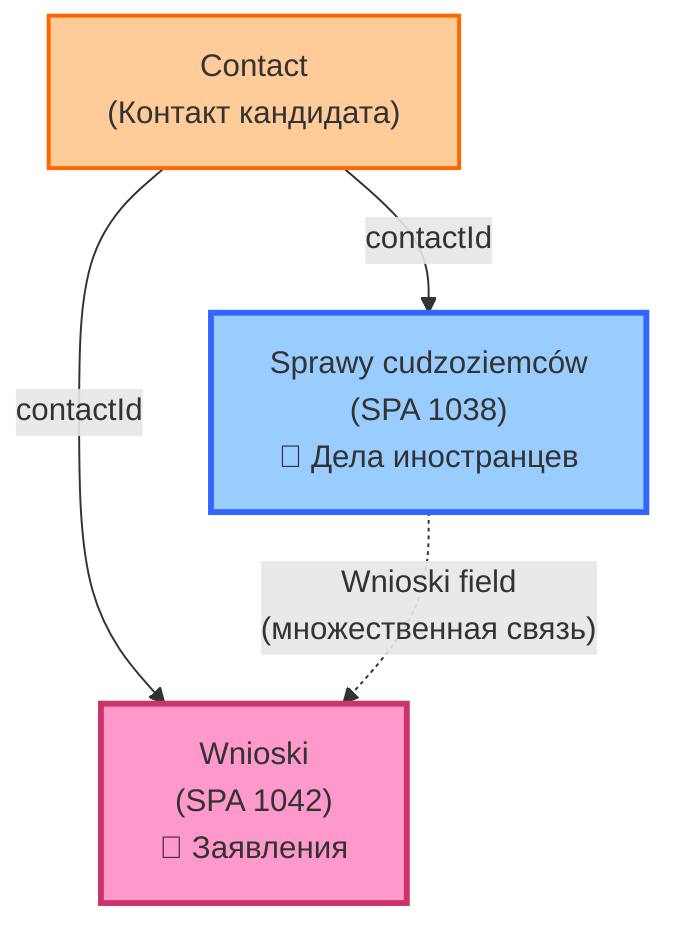
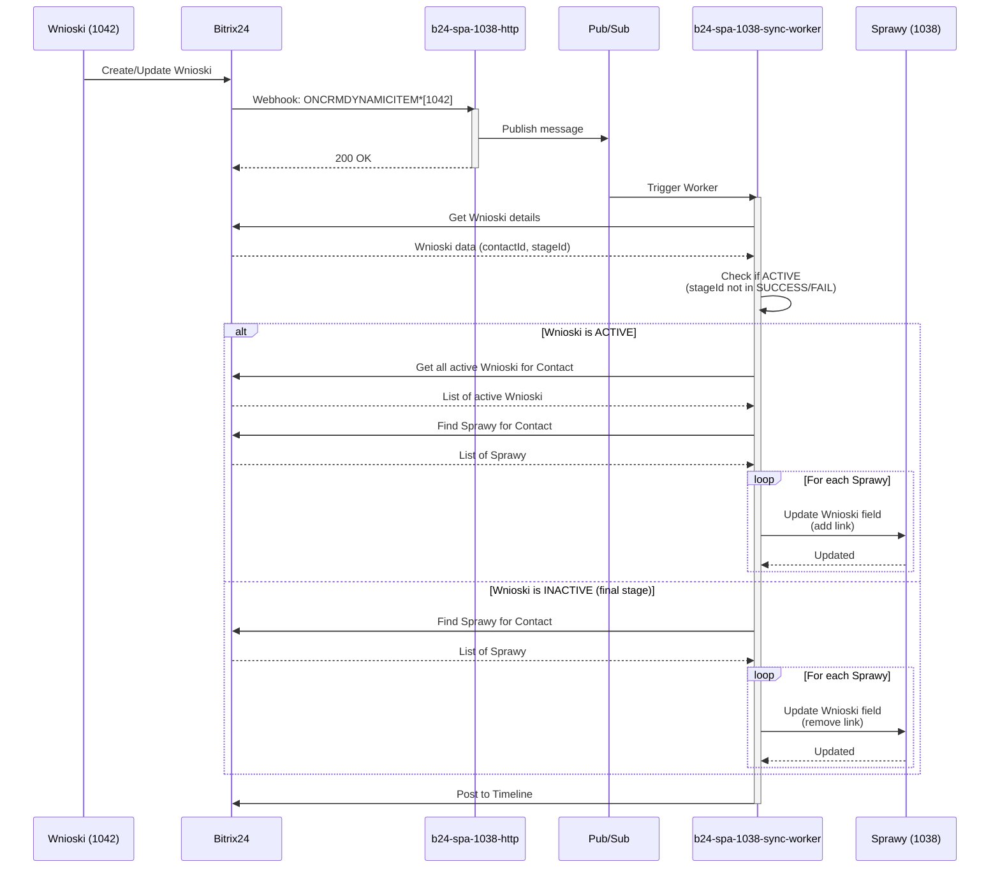

# Wnioski (SPA 1042)

> **Объект: Заявления**
>
> Версия: 1.1 | Последнее обновление: 2026-01-04

---

## 🎯 Назначение объекта

**Wnioski** - объект для управления заявлениями на визы, карты побыту и разрешения на работу.

**Основные функции:**
- Отслеживание процесса подачи заявлений
- Управление типами заявлений (виза, карта побыту, разрешение на работу)
- Этапы подачи и рассмотрения
- Хранение результатов и статусов
- Связь с делом иностранца (Sprawy cudzoziemców)

---

## 📊 Структура данных

### Основные поля

| Поле | Тип | Обязательное | Описание |
|------|-----|--------------|----------|
| `ID` | Integer | Да | Уникальный идентификатор заявления |
| `TITLE` | String | Да | Название заявления |
| `STAGE_ID` | String | Да | Стадия заявления |
| `CONTACT_ID` | Integer | Да | Связь с контактом (кандидатом) |
| `CREATED_TIME` | DateTime | Да | Дата создания |
| `UPDATED_TIME` | DateTime | Да | Дата последнего обновления |

### Пользовательские поля (UF_CRM_*)

> ⚠️ **TODO:** Получить полную структуру полей через Bitrix24 REST API:
> ```bash
> curl "https://bergermann.bitrix24.pl/rest/crm.type.fields?entityTypeId=1042&auth=..."
> ```

**Типичные поля:**
- Тип заявления (виза, карта побыту, разрешение на работу)
- Дата подачи
- Номер заявления
- Статус рассмотрения
- Результат (одобрено/отказано)
- Комментарии

---

## 📝 Структура формы

> ⚠️ **TODO:** Документировать детальную структуру формы после получения данных из API

---

## ⚙️ Свойства объекта

### Связи (Relations)



**Ключевые связи:**
- `Contact` → `Wnioski` (через `contactId`) - один контакт может иметь несколько заявлений
- `Sprawy cudzoziemców` → `Wnioski` (через поле связи) - в деле отображаются все активные заявления кандидата

### Стадии (Stages)

> ⚠️ **TODO:** Документировать стадии заявления (получить через API)

**Предполагаемые стадии:**
- `NEW` - Новое заявление
- `IN_PREPARATION` - Подготовка документов
- `SUBMITTED` - Подано
- `IN_REVIEW` - На рассмотрении
- `APPROVED` - Одобрено (SUCCESS)
- `REJECTED` - Отказано (FAIL)
- `CANCELLED` - Отменено

**Активные стадии** (синхронизируются с Cudzoziemcy):
- NEW, IN_PREPARATION, SUBMITTED, IN_REVIEW

**Финальные стадии** (НЕ синхронизируются):
- APPROVED, REJECTED, CANCELLED, SUCCESS, FAIL, FAILURE, COMPLETED

---

## 🔄 Процессы

### 1. Синхронизация с Sprawy cudzoziemców

**Триггер:** Создание/обновление/удаление Wnioski



**Логика синхронизации:**
1. При создании/обновлении Wnioski проверяется его статус (stageId)
2. Если статус **активный** (не SUCCESS/FAIL/COMPLETED):
   - Добавляется в поле "Wnioski" всех связанных Sprawy cudzoziemców
3. Если статус **финальный** (SUCCESS/FAIL/COMPLETED):
   - Удаляется из поля "Wnioski" всех связанных Sprawy cudzoziemców
4. При удалении Wnioski - удаляется из всех связанных Sprawy

**Ответственные сервисы:**
- `b24-spa-1038-sync` (HTTP + Worker)
- Сервис: `wnioski_sync.py`

### 2. Ежедневная синхронизация

**Расписание:** 03:00 UTC (Cloud Scheduler)

Выполняется полная синхронизация всех активных Wnioski для каждого контакта.

---

## 🔧 Функциональность

### Автоматизации

#### 1. Синхронизация активных заявлений

**Что делает:**
- Автоматически обновляет список активных заявлений в Sprawy cudzoziemców
- Фильтрует только активные заявления (исключая завершенные)

**Триггер:**
- Создание/обновление Wnioski
- Изменение статуса Wnioski
- Удаление Wnioski
- Ежедневная синхронизация (03:00)

**Фильтрация:**
- ✅ Включаются: NEW, IN_PREPARATION, SUBMITTED, IN_REVIEW
- ❌ Исключаются: SUCCESS, FAIL, FAILURE, COMPLETED, REJECTED, CANCELLED

### REST API методы

#### Получение заявления

```bash
curl -X POST "https://bergermann.bitrix24.pl/rest/crm.item.get" \
  -d "entityTypeId=1042" \
  -d "id=4" \
  -d "auth=[ACCESS_TOKEN]"
```

#### Создание заявления

```bash
curl -X POST "https://bergermann.bitrix24.pl/rest/crm.item.add" \
  -d "entityTypeId=1042" \
  -d "fields[contactId]=208" \
  -d "fields[title]=Wniosek o kartę pobytu" \
  -d "auth=[ACCESS_TOKEN]"
```

#### Обновление заявления

```bash
curl -X POST "https://bergermann.bitrix24.pl/rest/crm.item.update" \
  -d "entityTypeId=1042" \
  -d "id=4" \
  -d "fields[stageId]=DT1042_40:SUBMITTED" \
  -d "auth=[ACCESS_TOKEN]"
```

#### Получение списка заявлений

```bash
curl -X POST "https://bergermann.bitrix24.pl/rest/crm.item.list" \
  -d "entityTypeId=1042" \
  -d "filter[contactId]=208" \
  -d "order[id]=DESC" \
  -d "auth=[ACCESS_TOKEN]"
```

---

## 🔗 Связанные документы

- [Legalizacja Module Overview](../legalizacja-module.md) - Обзор модуля
- [Sprawy cudzoziemców (SPA 1038)](./sprawy-cudzoziemcow.md) - Дела иностранцев
- [Объекты модуля](./README.md) - Список всех объектов
- [b24-spa-1038-sync Service](../../../google-cloud/b24-spa-1038-sync/README.md) - Сервис синхронизации

---

## 📅 История изменений

### 2026-01-04 (v1.1)
- ✅ Реализована синхронизация с Sprawy cudzoziemców (SPA 1038)
- ✅ Создан сервис `wnioski_sync.py`
- ✅ Добавлена обработка событий SPA 1042 в worker
- ✅ Добавлена фильтрация активных/неактивных заявлений
- ✅ Документирована архитектура синхронизации

### 2026-01-04 (v1.0)
- ✅ Создан базовый документ объекта Wnioski

---

## 📝 Примечания

**Поле связи:**
- Код поля в Sprawy cudzoziemców: `ufCrm8_1767556733`
- Название: "Wnioski"
- Тип: CRM (множественная связь)
- Связь с: DYNAMIC_1042 (Wnioski)

**Пример значения:**
```json
"ufCrm8_1767556733": ["4", "5", "6"]  // IDs активных заявлений
```

---

**Автор:** KeyFrame Lab
**Версия:** 1.1
**Дата создания:** 2026-01-04
**Дата обновления:** 2026-01-04

