### Руководство по работе с Mermaid диаграммами в Cursor

Это руководство описывает настройку, синтаксис и лучшие практики создания диаграмм Mermaid в среде Cursor. Mermaid — язык описания диаграмм на основе текста, интегрированный с Markdown.

---

#### 1. Установка и настройка

**Расширение для Cursor/VSCode:**

```
bierner.markdown-mermaid
```

**Установка:**
1. Откройте Cursor → Extensions (Ctrl/Cmd + Shift + X)
2. Найдите `Markdown Preview Mermaid Support`
3. Нажмите Install

**Проверка установки:**
1. Создайте файл `test.md`
2. Добавьте простую диаграмму (см. пример ниже)
3. Откройте Preview (Ctrl/Cmd + Shift + V)

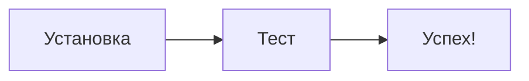

---

#### 2. Типы диаграмм

Mermaid поддерживает множество типов диаграмм. Ниже — наиболее полезные для документации проектов.

##### 2.1. Flowchart (graph) — Блок-схемы

**Направления:**
- `TB` / `TD` — сверху вниз (Top to Bottom)
- `BT` — снизу вверх (Bottom to Top)
- `LR` — слева направо (Left to Right)
- `RL` — справа налево (Right to Left)

**Базовый синтаксис:**

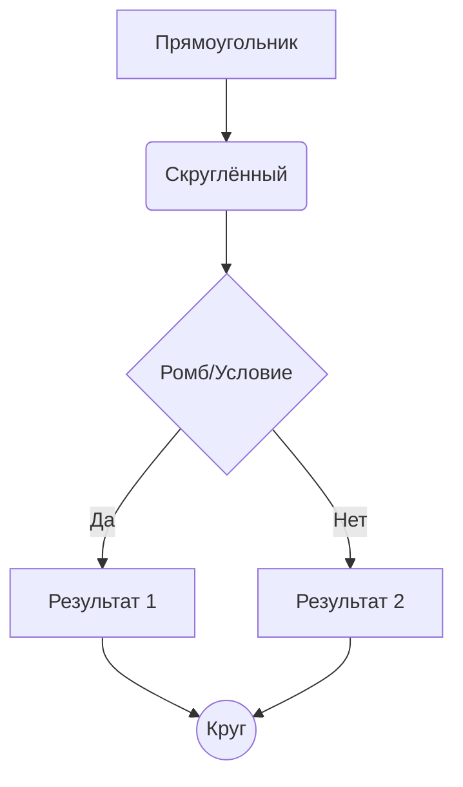

**Формы узлов:**

| Синтаксис | Форма |
|-----------|-------|
| `A[text]` | Прямоугольник |
| `A(text)` | Скруглённый прямоугольник |
| `A((text))` | Круг |
| `A{text}` | Ромб |
| `A[[text]]` | Подпрограмма |
| `A[(text)]` | Цилиндр (БД) |
| `A>text]` | Флаг |
| `A{{text}}` | Шестиугольник |

**Типы связей:**

| Синтаксис | Описание |
|-----------|----------|
| `A --> B` | Стрелка |
| `A --- B` | Линия без стрелки |
| `A -.-> B` | Пунктирная стрелка |
| `A ==> B` | Жирная стрелка |
| `A --text--> B` | Стрелка с текстом |
| `A -->|text| B` | Альтернативный текст |

---

##### 2.2. Sequence Diagram — Диаграммы последовательности

Идеальны для документирования API-взаимодействий и процессов.

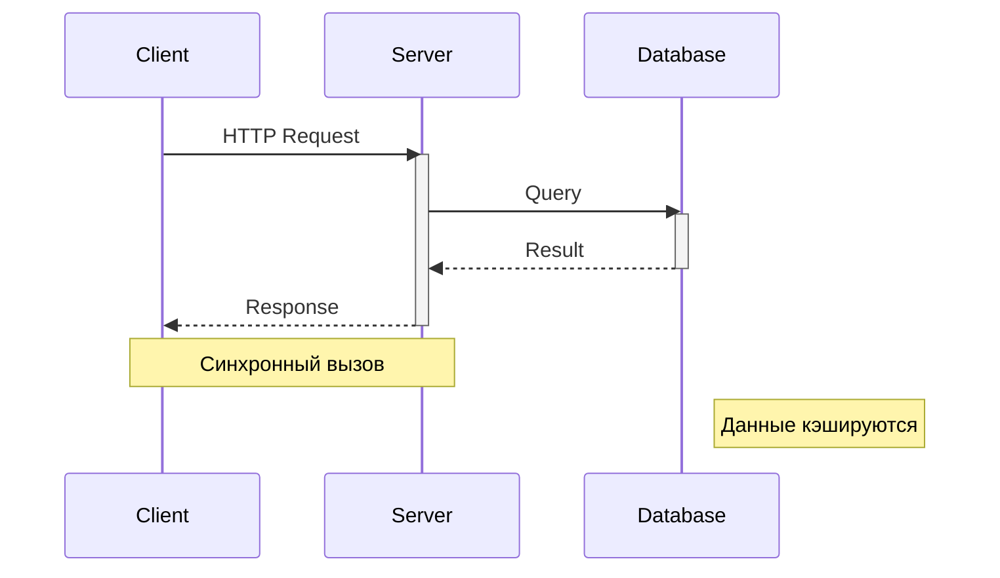

**Типы стрелок:**

| Синтаксис | Описание |
|-----------|----------|
| `A->>B` | Сплошная линия со стрелкой |
| `A-->>B` | Пунктирная линия со стрелкой |
| `A-xB` | Сплошная линия с крестом |
| `A--xB` | Пунктирная линия с крестом |
| `A-)B` | Сплошная линия с открытой стрелкой (async) |
| `A--)B` | Пунктирная с открытой стрелкой |

**Дополнительные элементы:**

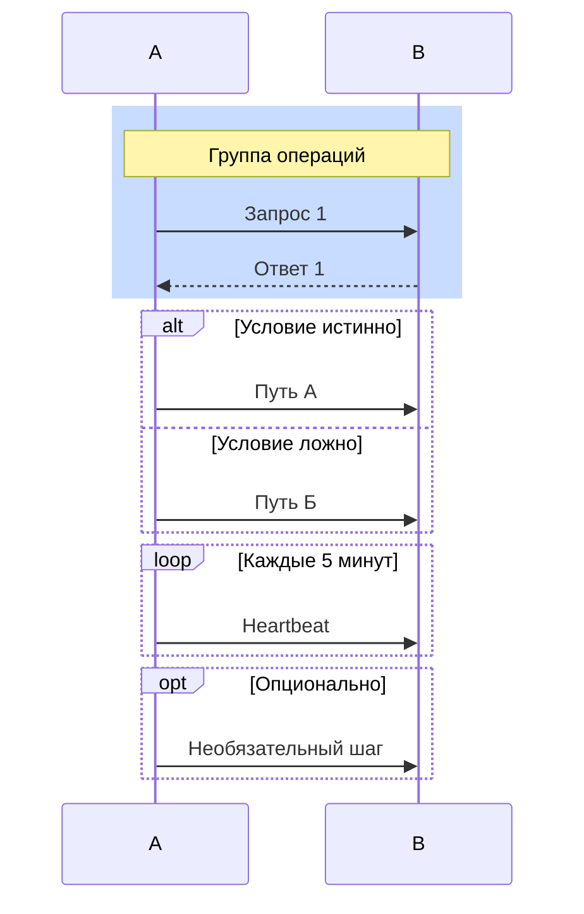

---

##### 2.3. Class Diagram — Диаграммы классов

Полезны для документирования структур данных и API-моделей.

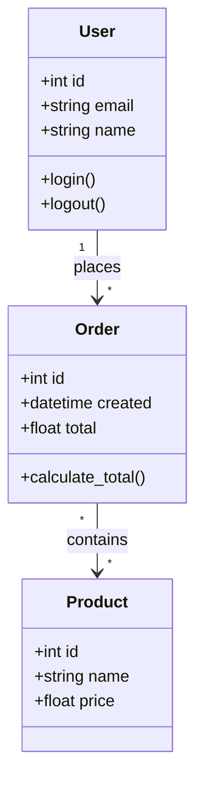

**Отношения:**

| Синтаксис | Тип связи |
|-----------|-----------|
| `A <\|-- B` | Наследование |
| `A *-- B` | Композиция |
| `A o-- B` | Агрегация |
| `A --> B` | Ассоциация |
| `A -- B` | Связь |
| `A ..> B` | Зависимость |
| `A ..\|> B` | Реализация |

---

##### 2.4. Entity Relationship Diagram — ER-диаграммы

Для документирования структуры баз данных.

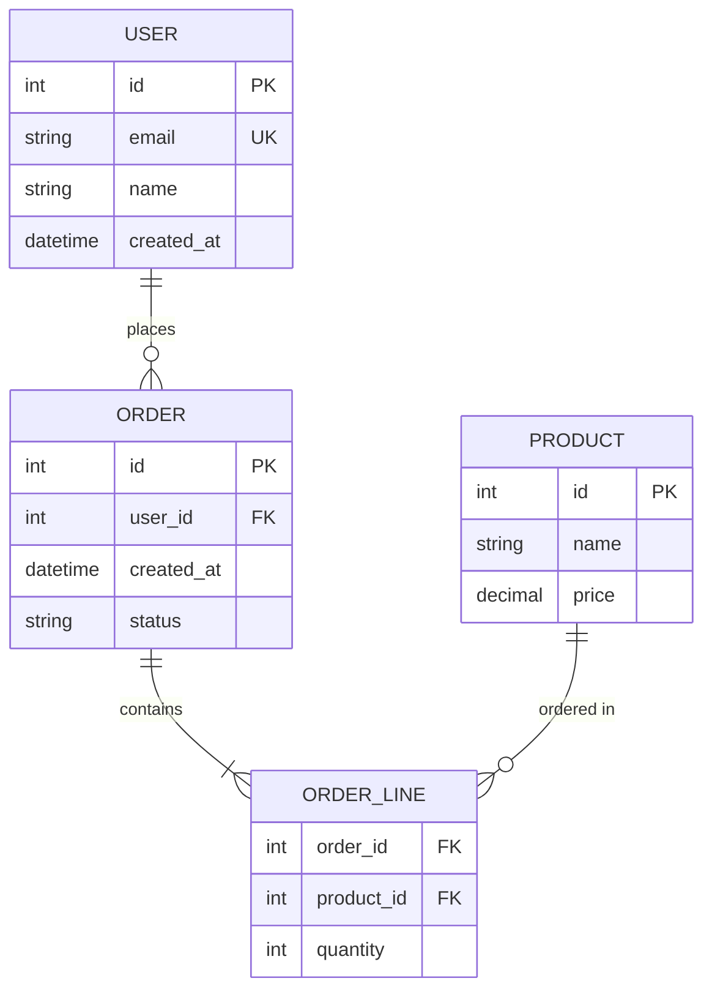

**Кардинальность:**

| Синтаксис | Значение |
|-----------|----------|
| `\|\|` | Ровно один |
| `o\|` | Ноль или один |
| `}\|` | Один или много |
| `}o` | Ноль или много |

---

##### 2.5. State Diagram — Диаграммы состояний

Для документирования жизненного цикла объектов.

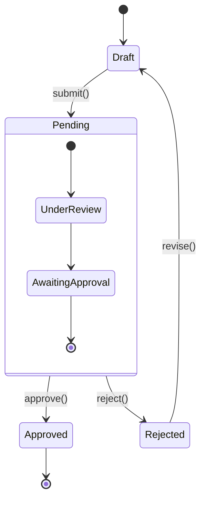

---

##### 2.6. Pie Chart — Круговые диаграммы

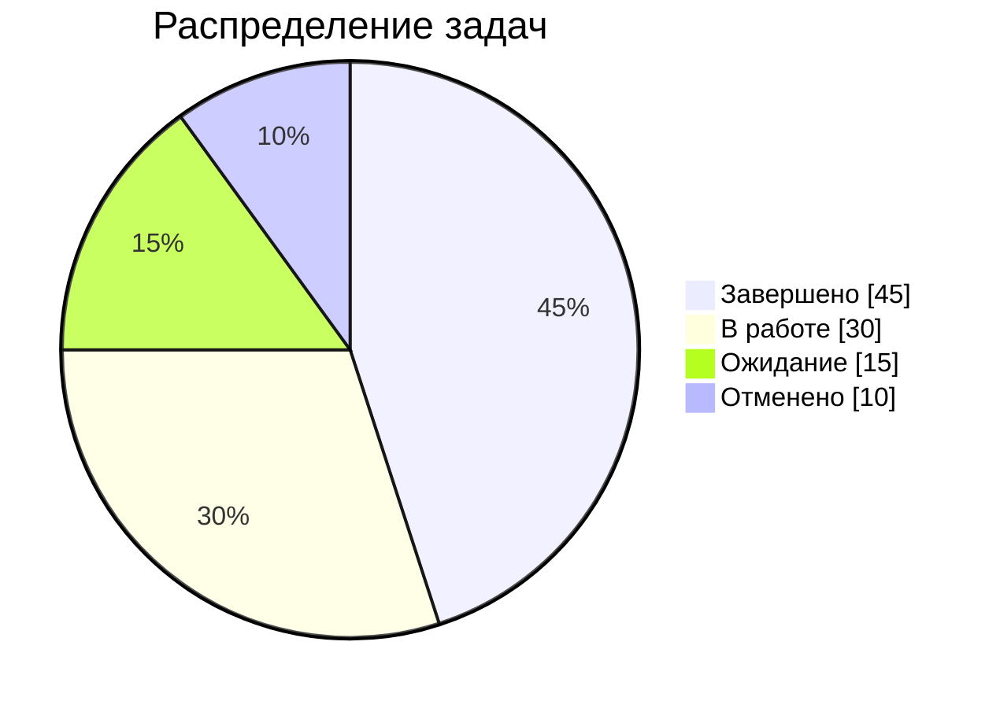

---

##### 2.7. Gantt Chart — Диаграммы Ганта

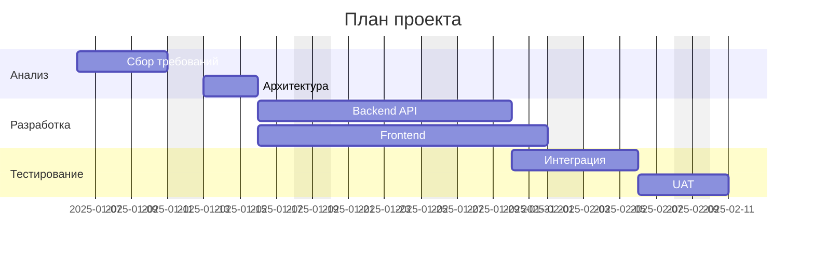

---

##### 2.8. Git Graph — Git-ветвление

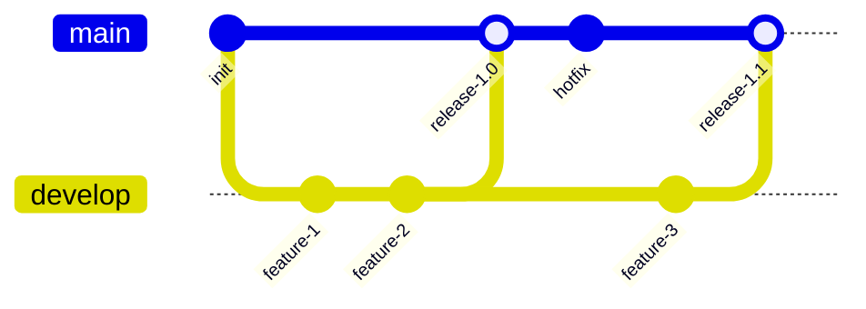

---

#### 3. Подгруппы и стилизация

##### 3.1. Subgraph — Группировка элементов

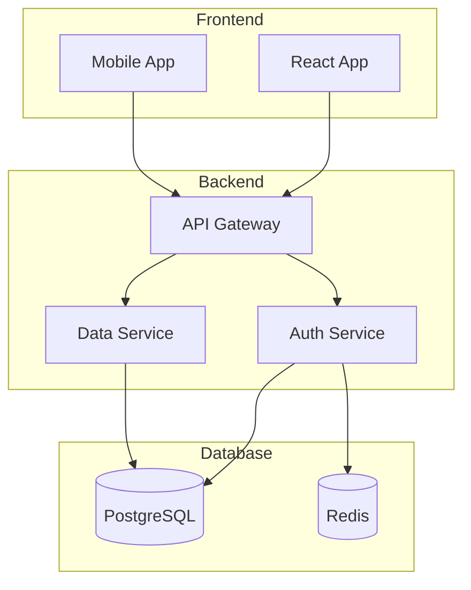

##### 3.2. Стилизация узлов

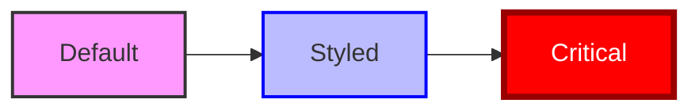

##### 3.3. Классы стилей

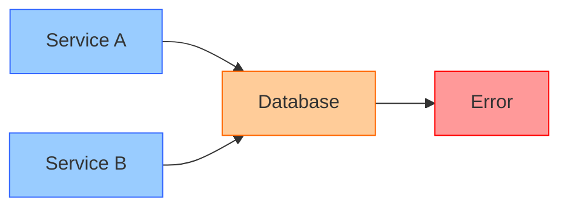

---

#### 4. Интеграция с Cursor AI

##### 4.1. Промпты для генерации диаграмм

**Для архитектурных диаграмм:**
```
Создай Mermaid диаграмму архитектуры системы, включающей:
- Frontend (React)
- Backend API (FastAPI)
- База данных (PostgreSQL)
- Кэш (Redis)
- Message Queue (RabbitMQ)
```

**Для sequence диаграмм:**
```
Создай Mermaid sequence диаграмму для процесса:
1. Пользователь отправляет запрос на авторизацию
2. API проверяет токен в Redis
3. Если токен не найден — запрос к БД
4. Возврат результата пользователю
```

**Для ER диаграмм:**
```
Создай Mermaid ER диаграмму для модели:
- User (id, email, name)
- Order (id, user_id, total, status)
- Product (id, name, price)
- OrderItem (order_id, product_id, quantity)
```

##### 4.2. Рекомендации при работе с AI

1. **Указывайте тип диаграммы** — `graph`, `sequenceDiagram`, `erDiagram` и т.д.
2. **Описывайте направление** — для flowchart указывайте `TD`, `LR` и т.д.
3. **Уточняйте детали** — количество элементов, связи, группировки
4. **Просите итеративные улучшения** — "добавь подгруппу", "измени стрелки на пунктирные"

---

#### 5. Best Practices

##### 5.1. Структура файлов

```
docs/
├── architecture/
│   ├── overview.md          # Общая архитектура
│   ├── data-flow.md         # Потоки данных
│   └── deployment.md        # Инфраструктура
├── api/
│   ├── auth-flow.md         # Sequence: авторизация
│   └── order-flow.md        # Sequence: заказы
├── database/
│   ├── schema.md            # ER-диаграмма
│   └── migrations.md        # История изменений
└── diagrams.md              # Сводный файл диаграмм
```

##### 5.2. Именование

* Файлы с диаграммами — в **kebab-case**: `user-flow.md`, `api-architecture.md`
* Идентификаторы узлов — краткие и понятные: `API`, `DB`, `Cache`
* Подгруппы — с заглавной буквы: `Backend`, `Frontend`, `Database`

##### 5.3. Читаемость

* **Максимум 15-20 узлов** на одной диаграмме
* **Используйте подгруппы** для логической группировки
* **Разбивайте сложные диаграммы** на несколько уровней детализации:
  - High-level: общая архитектура
  - Mid-level: компоненты модуля
  - Low-level: детали реализации

##### 5.4. Документирование

Каждая диаграмма должна сопровождаться:
1. **Заголовком** — что изображено
2. **Контекстом** — когда/где используется
3. **Легендой** — если используются специальные обозначения

---

#### 6. Экспорт и публикация

##### 6.1. Mermaid Live Editor

Онлайн-редактор для быстрого создания и экспорта:
```
https://mermaid.live/
```

Возможности:
- Редактирование в реальном времени
- Экспорт в PNG, SVG, PDF
- Шаринг по ссылке

##### 6.2. CLI-инструмент

```bash
# Установка
npm install -g @mermaid-js/mermaid-cli

# Генерация PNG
mmdc -i diagram.mmd -o diagram.png

# Генерация SVG
mmdc -i diagram.mmd -o diagram.svg

# Генерация PDF
mmdc -i diagram.mmd -o diagram.pdf
```

##### 6.3. GitHub/GitLab интеграция

GitHub и GitLab нативно рендерят Mermaid в `.md` файлах.
Диаграммы отображаются автоматически в Preview и README.

---

#### 7. Troubleshooting

##### 7.1. Диаграмма не рендерится

**Проверьте:**
1. Установлено расширение `bierner.markdown-mermaid`
2. Код начинается с ` ```mermaid ` и заканчивается ` ``` `
3. Нет синтаксических ошибок (проверьте в Mermaid Live)

##### 7.2. Ошибки синтаксиса

**Частые проблемы:**

| Ошибка | Причина | Решение |
|--------|---------|---------|
| `Parse error` | Неверный синтаксис | Проверьте скобки и стрелки |
| `Lexical error` | Спецсимволы в тексте | Оберните текст в кавычки |
| `Unknown diagram type` | Опечатка в типе | `sequenceDiagram`, не `sequence` |

**Экранирование спецсимволов:**

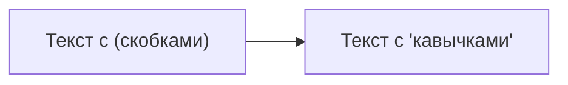

##### 7.3. Производительность

При большом количестве элементов (50+):
- Разбейте на несколько диаграмм
- Используйте подгруппы
- Упростите связи

---

#### 8. Шаблоны для проекта

##### 8.1. Шаблон архитектуры микросервиса

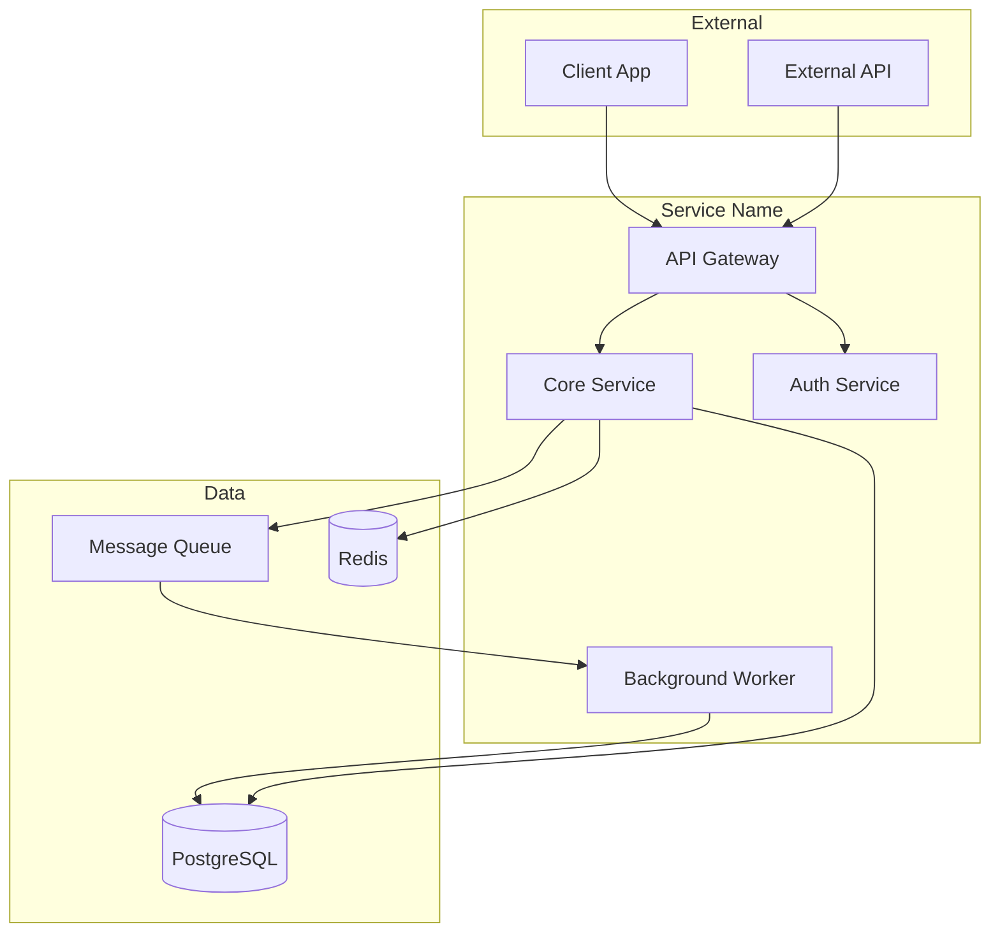

##### 8.2. Шаблон API-flow

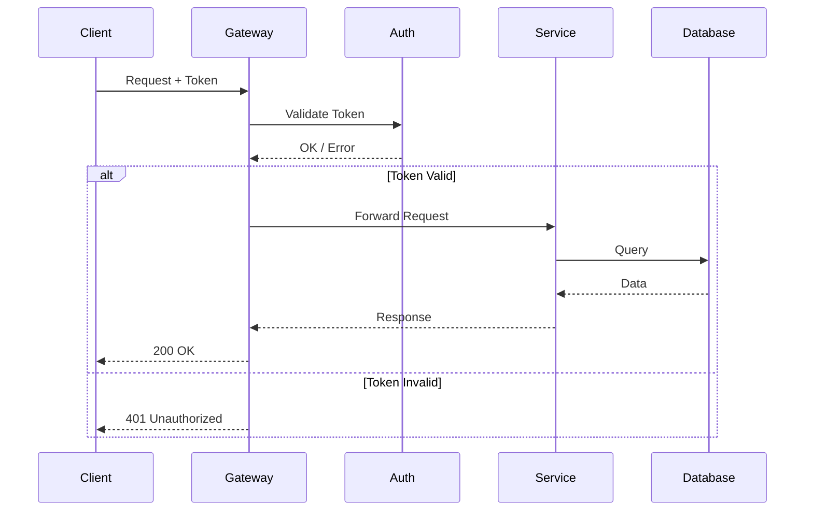

##### 8.3. Шаблон CI/CD Pipeline

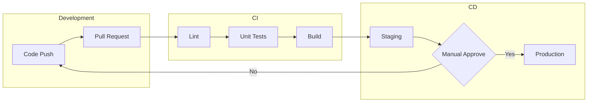

---

**Автор:** KeyFrame Lab Team
**Версия:** 1.0
**Дата создания:** 2025-01-04
**Источники:**
- [Mermaid Official Docs](https://mermaid.js.org/intro/)
- [Cursor Mermaid Guide](https://cursor.com/docs/cookbook/mermaid-diagrams)

